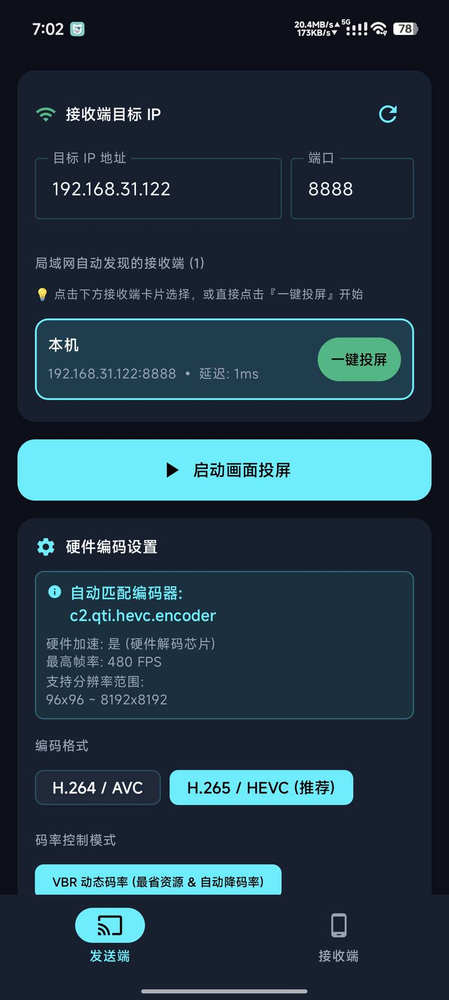
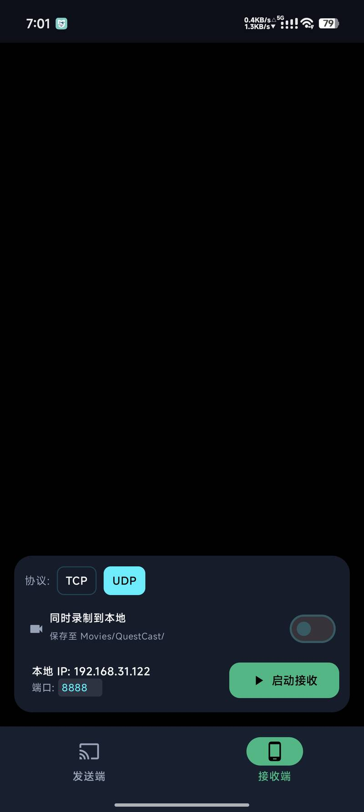
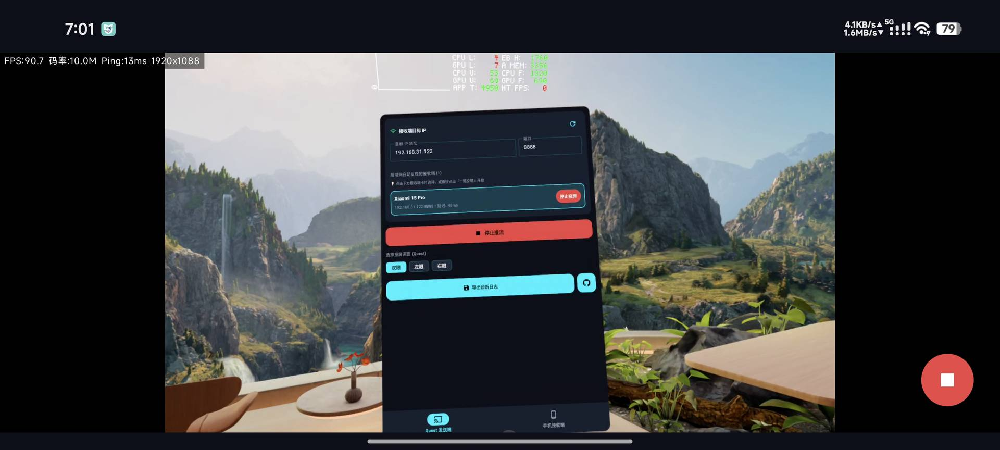

> [!CAUTION]
> 因Google将要实行的政策，开源软件在不久的将来很可能无法使用，详情：
> # [你的手机很快就不再属于你。保持安卓开放！](https://keepandroidopen.org/)

> [!CAUTION]
> 本软件仅在[本仓库](https://github.com/Cathgao/ScreenLiveStream)发布，未发布在其他网站、未上架任何商店，更没有在任何平台销售。
> 若你是付费获得本软件，那么你已经遭到诈骗，请立即向卖家或平台投诉，并要求全额退款。

# QuestCast VR

> 在局域网内，将 Meta Quest 画面低延迟投送到 Android 手机或平板。
>
> 支持硬件 H.264/H.265 编码、TCP/UDP 传输和接收端本地录制。

QuestCast VR 是一个无需云端服务的 Android 投屏工具：一台Android设备作为发送端捕获画面与系统音频，另一台Android设备作为接收端解码、播放并可选录制。两台设备只需要连接到同一个可互通的 Wi-Fi/LAN。

## 主要功能

- **发送端与接收端合一**：同一个 APK 可在 Quest 或普通 Android 设备上切换角色。
- **低延迟视频链路**：使用 Android `MediaProjection` 捕获画面，优先使用设备可用的硬件编码器。
- **H.264 / H.265**：支持 AVC 与 HEVC，默认使用 H.265/HEVC + VBR。
- **灵活的画面设置**：可调整分辨率、帧率和码率。
- **TCP / UDP 传输**：TCP 更适合稳定传输；UDP 路径支持 FEC，适合优先考虑延迟的场景。
- **局域网自动发现**：接收端通过 UDP 广播公告自身，发送端可自动显示可用设备。
- **实时状态监控**：接收端显示 FPS、码率、RTT/Ping 和分辨率。
- **可选本地录制**：接收端可以将视频和音频封装为 MP4，保存到 `Movies/QuestCast/`。

## 截图预览

### 发送端：自动发现与编码设置

<p align="center">
  
</p>

发送端可以自动发现局域网中的接收设备，也可以手动填写目标 IP 和端口。编码设置支持 H.264/AVC、H.265/HEVC、VBR/CBR/CQ、目标帧率、分辨率和传输协议选择。

### 接收端：选择协议并开始监听

<p align="center">
  
</p>

接收端可在 TCP 和 UDP 之间切换，并选择是否将收到的画面和音频保存到本地 `Movies/QuestCast/` 目录。

**注意：发送端与接收端必须选用同一种协议！**

### 实际投屏效果

<p align="center">
  
</p>

播放过程中会显示实时 FPS、码率、Ping 和视频分辨率等状态信息，便于判断网络和编码性能。

## 使用方法

### 1. 准备设备

1. 将发送端和接收端安装到两台 Android 设备上。
2. 确认两台设备连接到同一个 Wi-Fi/LAN，并且网络没有启用 AP 隔离或访客网络隔离。
3. 接收端默认监听 `8888` 端口，局域网设备发现使用 `9998` 端口。

### 2. 启动接收端

1. 打开应用并切换到底部的 **接收端**。
2. 确认监听端口，选择 `UDP` 或 `TCP`。
3. 如需保存视频，打开 **同时录制到本地**。
4. 点击 **启动接收**，保持应用运行。

### 3. 启动发送端

1. 在发送设备切换到 **发送端**。
2. 从局域网自动发现列表中选择接收设备，或手动输入接收端 IP 和端口。
3. 根据需要选择编码格式、码率、帧率、分辨率、传输协议。
4. 点击 **启动画面投屏**，按系统提示授予录屏和音频捕获权限。
5. 投屏开始后，可在接收端查看实时状态；停止时点击页面或通知栏中的停止按钮。

> Android 10 及以上版本的音频捕获受系统 `MediaProjection` 和应用音频策略限制。首次启动时可能需要同时授予录音/音频捕获和通知权限。

## 默认配置

| 配置项 | 默认值 |
| --- | --- |
| 视频编码 | H.265 / HEVC |
| 码率控制 | VBR |
| 推流码率 | 16 Mbps |
| 帧率 | 原生帧率 |
| 传输协议 | UDP |
| 接收端口 | `8888` |
| 设备发现端口 | `9998` |
| 接收端抖动缓冲配置 | 50 ms |

实际可用的分辨率、帧率和码率会根据设备硬件编码器能力自动调整。

## 构建与运行

### 环境要求

- Android Studio
- JDK 21
- Android SDK Platform 36
- 支持 Android 7.0（API 24）及以上的设备

项目使用 Kotlin 2.2.10、Android Gradle Plugin 9.1.1 和 Gradle 9.6.0。

### 本地构建

```bash
# 调试 APK
./gradlew :app:assembleDebug

# 单元测试
./gradlew :app:testDebugUnitTest

# 静态检查
./gradlew :app:lintDebug
```

生成的调试 APK 位于：

```text
app/build/outputs/apk/debug/app-debug.apk
```

也可以直接在 Android Studio 中打开项目，等待 Gradle 同步完成后运行 `app` 配置。将 APK 安装到 Quest 通常需要开启开发者模式并使用 `adb install`。

### Release 构建

本地 Release 签名构建需要提供以下环境变量：

- `KEYSTORE_PATH`
- `STORE_PASSWORD`
- `KEY_PASSWORD`

不要将 keystore、密码或任何私密配置提交到仓库。

## GitHub Actions

仓库包含两条 Android CI 工作流：

- **Build APKs (Artifact)**：在 push 或手动触发时运行测试并构建 debug/release APK，产物以 GitHub Actions artifact 形式保留 14 天。
- **Android Release Build**：推送匹配 `v*` 的 tag 后运行测试和 lint，并将签名 Release APK 发布到 GitHub Release。

Release 工作流需要仓库配置签名相关 secrets（例如 `KEYSTORE_BASE64`、`STORE_PASSWORD` 和 `KEY_PASSWORD`）。

## 技术栈

- Kotlin + Jetpack Compose + Material 3
- Android `MediaProjection`、`MediaCodec`、`AudioPlaybackCapture`
- 自定义视频/音频分包协议
- TCP、与 UDP FEC 传输
- Android MediaCodec 视频解码、AAC 音频解码
- MediaMuxer/MediaStore 本地 MP4 录制
- JUnit、Robolectric、Roborazzi 和 Espresso 测试

## 权限与隐私

应用会根据功能请求以下权限：

- `INTERNET`：发送视频、音频和网络控制数据。
- `ACCESS_NETWORK_STATE`、`ACCESS_WIFI_STATE`、`CHANGE_WIFI_MULTICAST_STATE`：获取本机地址和执行局域网设备发现。
- `RECORD_AUDIO`、MediaProjection 相关权限：捕获系统允许的音频和屏幕内容。
- 前台服务和通知权限：保证投屏/接收服务在后台运行时有明确的系统通知。
- 存储相关权限：在支持的 Android 版本上保存录制文件和导出的诊断日志。

视频和音频默认只在局域网设备之间直连传输。项目不包含账号体系、云端中继或遥测服务。但当前协议没有额外的端到端加密和访问认证，请只在可信网络中使用。

## 已知限制

- 目前仅支持局域网直连，不提供公网中继或跨网络连接。
- 自动发现依赖 UDP 广播；如果路由器阻止广播，请手动填写接收端 IP。
- 可用编码格式和分辨率取决于设备上的 MediaCodec 硬件能力。
- Meta Quest 固件对相关系统属性的支持。
- 音频捕获受 Android 版本、MediaProjection 授权和应用音频策略限制。

## 许可证

本项目基于 [GPL-3.0 license](LICENSE) 开源。
